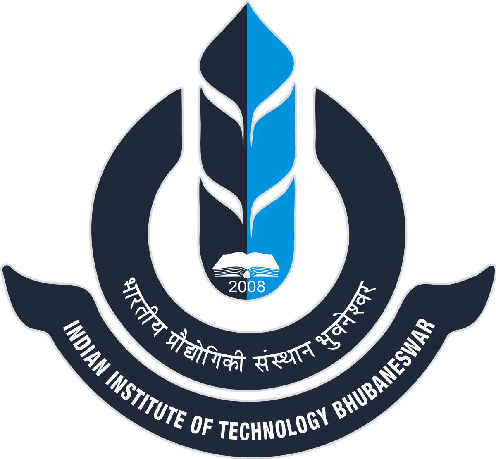

<figure style="display: flex; align-items: center;">
    
    <figcaption>
        <b> MS in Computer Science (Machine Learning)</b> 
         Georgia Institute of Technology 
    </figcaption>
</figure>
<!-- #### **MS in Computer Science (Machine Learning)**
#### Georgia Institute of Technology -->
Aug 2022 - May 2024 (Expected)

**GPA:** 4.0/4.0

**Courses:** 
- Machine Learning, Natural Language Processing, Web Search and Text Mining
- Interactive Robot Learning, Algorithms, Knowledge Based AI

<figure style="display: flex; align-items: center;">
    
    <figcaption>
        <b>BS/MS in Computer Science and Engineering</b> 
        Indian Institute of Technology (IIT) Bhubaneswar 
    </figcaption>
</figure>
<!-- #### **BS/MS in Computer Science and Engineering**
#### Indian Institute of Technology (IIT) Bhubaneswar -->

Jul 2017 - May 2022

**GPA:** 9.79/10 (Graduated top of the class)

**Courses:**
- **Core CS:** 
    - Operating Systems, Computer Network, Database Management Systems
    - Data Structures, Advanced Algorithms
    - Compiler Design, Computer Architecture, Formal Language and Automata Theory
- **Math:** 
    - Linear Algebra, Advanced Calculus, Discrete Structures
    - Combinatorics, Probability and Statistics, Mathematical Methods
- **Electives:** 
    - Machine Learning and Data Analytics, Information Theory and Coding
    - Networks and System Security, Applied Graph Theory, High Performance Computer Architecture
    
<!-- 
**Publications:**
- **S. Prasath**, K. Sethi, D. Mohanty, P. Bera and S. R. Samantaray, ["Analysis of Continual Learning Models for Intrusion Detection System,"](https://ieeexplore.ieee.org/document/9953983) in IEEE Access, vol. 10, pp. 121444-121464, 2022, doi: 10.1109/ACCESS.2022.3222715.
- D. Mohanty, K. Sethi, **S. Prasath**, R. R. Rout and P. Bera, ["Intelligent Intrusion Detection System for Smart Grid Applications,"](https://ieeexplore.ieee.org/document/9478200) 2021 International Conference on Cyber Situational Awareness, Data Analytics and Assessment (CyberSA), Dublin, Ireland, 2021, pp. 1-8, doi: 10.1109/CyberSA52016.2021.9478200. -->

