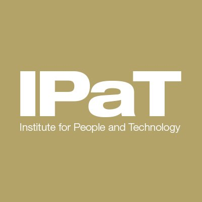

<figure style="display: flex; align-items: center;">
    
    <figcaption>
        <b>Graduate Student Researcher</b> 
    </figcaption>
</figure>

Aug 2023 - Present

[Computational Data Science Lab for the Web and Social Media](https://faculty.cc.gatech.edu/~srijan/), GeorgiaTech, Atlanta, US

- Studying the behaviour of LLMs and their applications in countering mis-information

<figure style="display: flex; align-items: center;">
    
    <figcaption>
        <b>Machine Learning R&D Intern</b> 
    </figcaption>
</figure>

May 2023 - Aug 2023

[Keysight Labs](https://research.gatech.edu/ipat): Advanced Software Development Center, Atlanta, US

- Enhanced the ML Testing toolbox by developing mutual information based feature visualizations and integrating
SHAP for multi-class classification models
- Evaluated the end-to-end development of machine learning models (CNN for 5G Beam Selection, Autoencoder
Based Channel Estimator and Equalizer, Error Correction Transformers) using Keysight’s AI-testing pipeline
- Contributed to the AI Testing White Papers on Supervised and Unsupervised learning models

<figure style="display: flex; align-items: center;">
    
    <figcaption>
        <b>Graduate Research Assistant</b> 
    </figcaption>
</figure>

Jan 2023 - May 2023

[Institute for People and Technology (IPaT)](https://research.gatech.edu/ipat), GeorgiaTech, Atlanta, US

- Developing an Emergency Management Portal using Flask and REACT for real-time tracking and monitoring of flooding in Georgia coastal counties. 
- Designing pipelines for processing and storing data in GCP collected from sensors across the Georgia coast. 

<figure style="display: flex; align-items: center;">
    
    <figcaption>
        <b>Deep Learning Intern</b> 
    </figcaption>
</figure>

Sep 2021 - Apr 2022

[iTrust Labs](https://itrust.sutd.edu.sg/itrust-labs-home/), Singapore University of Technology and Design, Singapore

##### **Anomaly Detection in Multi Variate Time Series**
- Developed a dual attention (spatial and temporal) based LSTM/GRU model to pre-emptively detect anomalies in a power plant. 
- Minimized costs by reducing the false alarm rate to 0.21% with a high detection accuracy of 97.8%.    

##### **Semi-Supervised GAN based Trojan Detection**   
- Researched and implemented a novel semi-supervised GAN for detecting trojaned DNNs. 
- Enhanced detection capabilities by integrating a Denoising Autoencoder for attack agnostic one-class training. 
- Achieved state-of-the-art performance +3% AUC on computer vision tasks while reducing run-time by 15%.

<figure style="display: flex; align-items: center;">
    
    <figcaption>
        <b>Machine Learning Intern</b> 
    </figcaption>
</figure>

Sep 2021 - Apr 2022

[Fraunhofer IOSB and Karlsruhe Institute of Technology](https://www.iosb.fraunhofer.de/en.html), Germany

- Implemented black-box ZOO and FGSM attacks on DL based Intrusion Detection System. Handled system specific constraints: binary features, one-hot encoded variables, preserving attack capabilities. 
- Studied various defense mechanisms including adversarial training, defensive distillation, and denoising
autoencoder. 
- Integrated Explainable AI tools such as PDP Plots and SHAP to perform understandable and trustworthy decision making. 

<figure style="display: flex; align-items: center;">
    
    <figcaption>
        <b>Covid-19 Modeling Intern</b> 
    </figcaption>
</figure>

<!-- #### **Covid-19 Modeling Intern**  -->

Jul 2020 - Sep 2020

[PRETzel Group](https://pretzel.ece.auckland.ac.nz/#!home), University of Auckland, New Zealand

- Implemented agent(Stochastic Te Punaha Matatini) and differential equation(Modified SEIR, CovidSim 2.0) based
covid-19 models using hybrid automata using composition modelling. 
- Performed multi-model simulations with different plants and controllers to find the optimal control strategy.
- Analysed the trade off between the economic impact and the health impact by generating a pareto front using ϵ constraint method and particle swarm optimization.

