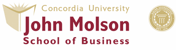

<figure style="display: flex; align-items: center;">
    
    <figcaption>
        <b>Graduate Teaching / Research Assistant - UCLA</b> 
        Jan 2024 - Present
    </figcaption>
</figure>

- Developing statistical software/libraries for hypothesis testing. [Learn more](https://pypi.org/project/statistics-library/).

<figure style="display: flex; align-items: center;">
    
    <figcaption>
        <b>SDE 2 - Citi, AI & Operations Innovation Lab</b> 
        July 2021 - Sept 2023
    </figcaption>
</figure>

- Led AIOPS team; developed LLM, NLP & ML models saving over $250K annually.
- Established command center, reducing downtime by 10%, saving ~$1M.
- Innovated in HNI/UHNI division, enhancing client services.
- Implemented Agile and new tech stacks, saving 100+ person-hours.
- Developed ML automation model, reducing incidents by 13%.

**Achievements:** [Citi Awards and Recognitions](https://drive.google.com/file/d/1vz_iv6zuMCkshuL85D0IB-uaBy-M19_y/view?usp=sharing)
- Gold Gratitude Award
- Bronze, Copper Gratitude Award
- Client Obessision Award, Bravo Award

<figure style="display: flex; align-items: center;">
     
    <figcaption>
        <b>MITACS Globalink Research Intern - Concordia University</b> 
        April 2020 - July 2020
    </figcaption>
</figure>

- Developed supply chain model increasing Walmart Canada's profit by 6%.

<figure style="display: flex; align-items: center;">
    
    <figcaption>
        <b>Research Intern - IIT Madras NCCRD Lab</b>
    </figcaption>
</figure>

- Developed a MATLAB model to perform data analytics (data cleaning, data processing, and data visualization) to detect abnormalities for the development of a new Gasoline Direct Injection engine in a single cylinder in NCCRD Lab.

<figure style="display: flex; align-items: center;">
    <figcaption>
        <b>Machine Learning Intern - Vevolve</b>
    </figcaption>
</figure>

- Collaborated in a team for an R&D project and developed machine learning models (web scrapping, texting mining) in cybersecurity to evaluate the vulnerabilities of the PHP application, generating revenue share of $30K from this project.

