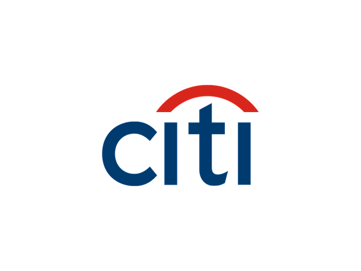

### Graduate Teaching / Research Assistant - University of California, Los Angeles, US
  
*Jan 2024 - Present*  
Developing software/libraries for hypothesis testing using statistical sampling and bootstrapping techniques. [Learn more](https://pypi.org/project/statistics-library/).

---

### SDE 2 at Citi - Artificial Intelligence & Operations (Innovation Lab)
  
*July 2021 - Sept 2023*  
- Led an AIOPS team, driving innovations in LLM, NLP, and forecasting ML models, saving >$250K annually.
- Initiated the command center in Chennai, averting 50+ major incidents, saving ~$1M globally.
- As Innovation Manager in HNI/UHNI division, enhanced business model and client services in wealth management.
- Revamped tech stack and streamlined Agile processes, saving 100+ hours.
- Developed a full-stack ML automation model, reducing incidents by 13%.

**[Awards and Achievements at Citi](https://drive.google.com/file/d/1vz_iv6zuMCkshuL85D0IB-uaBy-M19_y/view?usp=sharing)**
- Gold Award
- Bronze Award
- Copper Award
- 10+ Apprectiation Award
- Client Obessision Award/ Bravo Award

---

### MITACS Globalink Research Intern - Concordia University, Canada
  
*April 2020 - July 2020*  
Developed a supply chain model for Walmart Canada, boosting profits by 6%. This model used heuristics and greedy algorithms in C++ to optimize assortment planning.

---

### Machine Learning Intern - Vevolve
*May 2020 - September 2020*
Participated in an R&D project, creating ML models for cybersecurity, enhancing the security posture of PHP applications and generating a $30K revenue share.
